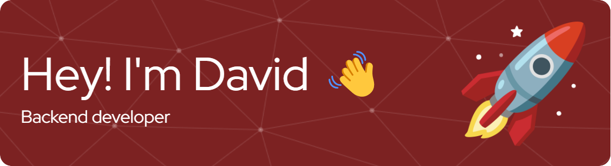

-------------------
&emsp;
<h3 align="left">Hi 👋, I'm David, a Backend Engineer based in Spain. I'm passionate about crafting innovative solutions and exploring emerging technologies. Currently completing a Master's in Software Engineering and always excited to take on new projects 🚀</h3>
&emsp;

-------------------
&emsp;

- 🔭 I’m currently working on Unagi, an AI-driven cybersecurity platform focused on code security and automated pentesting.
- 📚 I’m also finishing my Master's in Software Engineering and exploring new technologies, including AI, automation, and cybersecurity.
- 🌱 I’m currently learning **AI-driven Automation, Cybersecurity, and Software Development Practices**.
- 💬 Ask me about **AI, Automation, Cybersecurity, Python, JavaScript, and Artificial Vision**.

&emsp;

## Me around the web:
-------------------

&emsp;

&emsp;

## 🛠️ My Skills
-------------------
### Programming languages:
&emsp;

### Frameworks:
&emsp;

### Frontend development:
&emsp;

### Mobile Development:
&emsp;

### Misc tools:
&emsp;

### Databases:
&emsp;

### SRE & DevOps:
&emsp;

&emsp;

------
Credit: [David](https://github.com/davidbv01)  
Last Edited on: 07/04/2025
